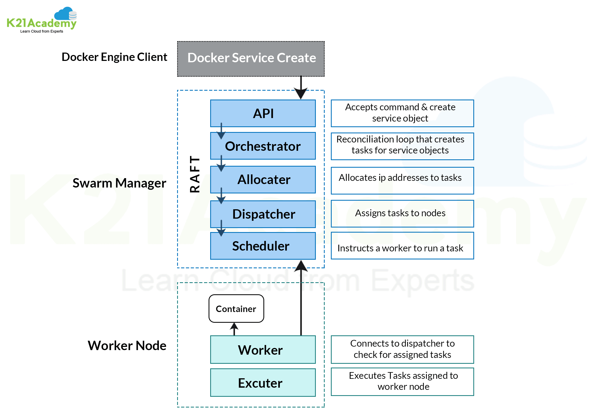

## My experience through docker swarm, some important commands & confs



### Managing swarm

```bash
$ docker node ls
$ docker swarm init
$ docker swarm join-token --quiet
$ docker node promote NODE_X # promote a node to become manager in maintenance mode
$ docker node promote NODE_X # demote a node
```

### Updates

The `docker node update` command could update a nodes status or assign any labels to a specific node, help you better handle the node in maintenance mode etc.

```bash
$ docker node update --availability drain NODE_X # drain a node for maintenance mode
$ docker node update --availability active NODE_X # active a node to get back to the cluster
$ docker node update --label-add foo
$ docker node update --label-add A=B
$ docker node inspect self --pretty
```

### Service & Stack

The `service` command is a way of launching containers that take advantage of the Swarm cluster. Let's look at launching a really basic single-container service on our Swarm cluster.

```bash
$ docker service create --name web --publish 8080:80 nginx # creates a service and bring it up
$ docker service inspect SERVICE_NAME --pretty
$ docker service logs SERVICE_NAME
```

`Stacks` are Swarm’s way of managing multiple services defined in a single file.

```yaml
version: "3.8"
services:
  web:
    image: nginx
    ports:
      - "8080:80"
    deploy:
      replicas: 2
      restart_policy:
        condition: on-failure
    volumes:
      - webdata:/usr/share/nginx/html

volumes:
  webdata:
```

### deploy section

```yaml
deploy:
  replicas: 2
  restart_policy:
    condition: on-failure
  placement:
    constraints:
      - node.labels.A == B
      - node.role == worker
      - node.labels.test_node_label == true
```

<br>
using `constraints` we could assign a service to deploy on some specific nodes, since our labels work in a `<key>=<value>` format, we can access them like i did above
<br>

```bash
$ docker stack deploy -c docker-compose.yml myapp # deploy our program using compose file
$ docker stack ls
$ docker stack rm STACK_NAME
$ docker stack ps STACK_NAME # List the tasks in the stack
```


### Load balancing, overlays, and scheduling
